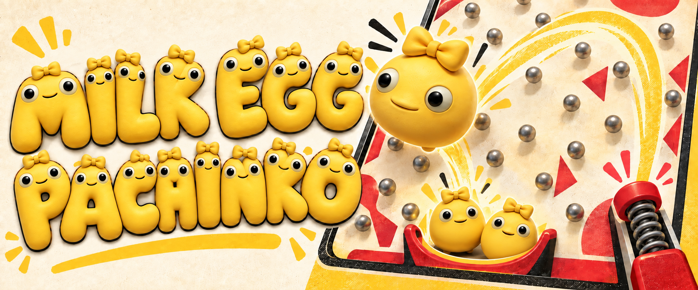

# Milk Egg Pachinko
### 蛋珠机

**English** · [简体中文](README.zh-CN.md)

Charge it. Launch it. See where the egg ends up.

**[Play now](https://astudenttt.github.io/milk-egg-pachinko/dist/)** · [Report a bug](https://github.com/AStudenttt/milk-egg-pachinko/issues)

## Meet Milk Egg

Word has it that when Milk Frog fell from the sky, a yellow egg came down with it. Nobody knew who laid it or what was inside. People put it in a temple and waited for it to hatch. Years went by. Nothing. Then it rolled off the altar and cracked a floor tile. The egg? Not a scratch. They called it Milk Egg.

They tried boiling it. Roasting it. No luck. Then some guy with a spring launched it across the room. It bounced off a few metal pegs, dropped into a tiny slot, and somehow came out as a whole bunch of eggs. Everyone scrapped the altar and got busy building a machine.

And that’s Milk Egg Pachinko. Nobody cares what’s gonna hatch anymore. They just wanna know how many eggs are coming out next.

## One egg. Plenty of trouble.

An arcade-style pachinko game starring Milk Egg. Launch up the right-hand rail, bounce through the pegs, and aim for a lit channel at the bottom.

Choose how many eggs to put in, lock in the multiplier and winning channels, then charge your shot. The launch strength affects the egg’s actual movement—the landing channel is not chosen in advance.

## How to play

1. **Choose your stake:** Use + and −, with adjustment steps of 1, 5, or 10.
2. **Start the round:** Lock in the multiplier and lit channels.
3. **Charge and launch:** Hold the launch control, then release. On desktop, you can also hold and release Space.
4. **Watch the landing:** A lit channel pays out your stake × the multiplier.

You start with 100 eggs and can put in up to 50 per round. The stake is deducted when the round is locked. A shot too weak to reach the peg board can be retried without another deduction.

## Play in your browser

No download required. Supports desktop and touch screens.

The game interface is currently in Chinese. All eggs are virtual: no payments, cash value, redemption, or trading.

## Feedback

Found a bug? Open an issue with a screenshot, your device and browser, and the steps that led to it.

## Another little game

Try **[Milk Frog Merge](https://github.com/AStudenttt/milk-frog-merge)**—drop matching frogs, merge them, and try not to run out of room.

Development notes

### Run locally

Serve the `dist` directory with any static web server. No dependency installation is required.

### Implementation

Static HTML, CSS, and Canvas, with no remote runtime dependencies. `dist/physics.js` handles circle, peg, and rail collisions at a fixed 240 Hz. `dist/game.js` handles controls, lights, sound, and inventory settlement.

The character assets are an initial set generated from reviewed Milk Egg / Milk Frog references and can be replaced as the artwork is refined.

### GitHub Pages

Configure Pages to deploy from the `main` branch, using `/(root)`. The root entry redirects to `dist/`.

